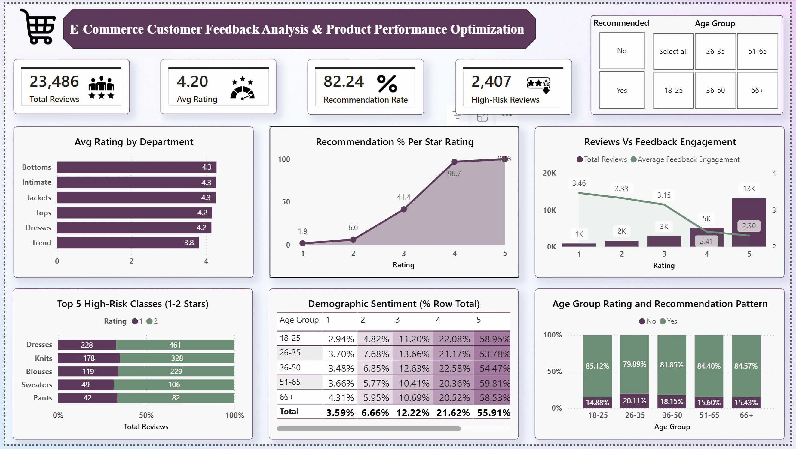

# E-Commerce Customer Sentiment & Operational Risk Analytics

## Executive Summary
This project develops a full data analytics pipeline which translates 23,000+ unstructured customer reviews of women's products into actionable strategies for corporate decision-makers. Via end-to-end development in Power BI and Power Query, the analysis discovers operational risks which lay beneath strong baseline metrics. The final executive dashboard enables stakeholders to isolate severe quality-control anomalies, map customer advocacy thresholds, and deploy targeted, revenue-protecting sourcing interventions.

* 📄 **[Download the Full Executive Summary (PDF)](docs/EXECUTIVE_SUMMARY.pdf)**
* 📑 **[Download the Business Questions Deep-Dive (PDF)](docs/BUSINESS_QUESTIONS.pdf)**

## Business Problem
At first glance, this retail brand demonstrates excellent health metrics, having 4.2/5 average rating and 82% of customer referral rate. However, standard high-level reporting conceals major underlying inefficiencies on the operations side. The company lacks visibility of the nature and scale of negative feedback on digital platforms, location of the operational breakdowns, and whether specific age demographics required different product specifications. Without these insights, the company faces risks to customer lifetime value (LTV) and brand loyalty.

## Objectives
- **Build an End-to-End Analytics Pipeline:** Extract, clean, and model 23,000+ rows of raw and unstructured customer review data in a high-pressure development sprint.
- **Isolate Operational Firepoints:** Use segmentation and text mining to identify exact product classes that drive customer dissatisfaction.
- **Quantify Consumer Advocacy:** Find the precise mathematical correlation between star ratings, community engagement, and referral intent.
- **Deliver Executive-Ready Reporting:** Design an intuitive dashboard featuring a unified KPI banner and structured navigation to support strategic decisions.

## Dataset
- **Dataset Size:** 23,000+ customer reviews.
- **Data Attributes:** Contains quantitative metrics (ratings, upvotes, age, recommendation flags) and qualitative text attributes (review titles, review body, product classes).
- **Data Quality:** Handled missing text segments, standardized category labels, and created demographic buckets for consistent analysis.

## Tech Stack
- **Data Engineering:** Power Query (ETL, data cleaning, structural transformations)
- **Data Modeling:** Power BI Desktop (Star schema optimization, relationship mapping)
- **Analytics & Calculations:** DAX (Data Analysis Expressions) for dynamic measures
- **Visualization:** Power BI Reporting Layer (Executive UI design, custom KPI banner cards)

## Methodology
1. **ETL & Data Engineering:** Imported raw text data into Power Query. Standardized data types, cleaned null values, and parsed unstructured feedback into structured marketing and product segments.
2. **Data Modeling:** Created a very efficient data model to facilitate easy cross-filtering across product classes, age groups, and rating categories.
3. **Sentiment & Text Mining:** Picked out commonly repeated phrases from low-rating reviews to differentiate style preferences from actual manufacturing errors.
4. **UI/UX Dashboard Design:** Designed a coherent 4-card KPI banner with key metrics. Kept the dashboard clean and easy to read by using interactive filters so users can explore the data easily, and also moved the heavy text clouds into separate documentation to save space.

## Dashboard Preview

## Key Insights
- Although there are way more 5-stars reviews in the total amount of data available, just a single 1-star review receives **50.4% more community upvotes** than a positive one. Negative feedback is heavily amplified by online shoppers.
- Customer referrals are much safer when a customer rate is at or above 4 stars (**96% recommendation rate**); but the second a product falls to 3 stars, intent drops dramatically to **41%**.
- Operational quality issues are very isolated and not systemic. Among dozens of product classes, just two categories —**Dresses and Knits**— are responsible for a majority of all 1 and 2-star ratings. 
- Text analytics indicated that low ratings are not due to style preferences. Dissatisfied customers frequently mention physical manufacturing flaws, specifically **huge sizing errors and sub-standard fabric quality**.
- The requirements for product quality do no depend on consumer generation at all. Analysis across age groups (from Gen Z to Seniors) showed nearly identical satisfaction distribution patterns; the same quality is expected regardless of consumer's age.

## Business Recommendations
**1. Perform Focused Manufacturing Audit:** 
Immediate audit of manufacturing process and materials used specifically for the Dresses and Knits product categories to stop negative review loops.

**2. Improve Online Sizing Standards:** 
Update platform sizing charts and provide customers with sizing calculators on the product pages to prevent any sizing issues prior to making a purchase decision.

**3. Implement a Product Rating Intervention Threshold:** 
Automate the process to notify product teams the moment a product's average rating drops toward **3.5 stars**, to allow time for the team to intervene before rating dips below 3 stars.

**4. Manage Highly-Upvoted 1-Star Ratings:** 
Optimize customer service workflow to prioritize and resolve highly-upvoted 1-star customer complaints in order to avoid their spread online.

## Connect with Me
- **LinkedIn:** https://www.linkedin.com/in/Basil-Michael-Ifeagwa
- **GitHub:** https://github.com/VLogicBoard
- **Email:** ifeagwabasil@gmail.com